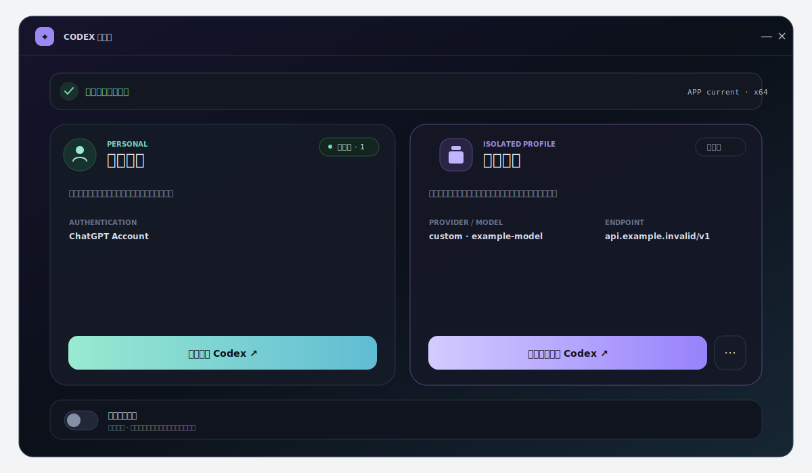

# Codex 多开器

[](https://github.com/yyyyyp233/codex-multi-launcher/actions/workflows/ci.yml)
[](LICENSE)

> **Unofficial community project.** A source-first Windows launcher that keeps the normal Codex App profile as the primary profile and can start any number of locally isolated profiles. Each managed profile can use a ChatGPT account, an OpenAI API key, or a third-party Responses-compatible provider. Requires Windows, the Codex Windows App, and .NET 10 SDK to build. It is not affiliated with or endorsed by OpenAI or Microsoft. The isolated launch path depends on an undocumented compatibility surface and locally prepares App runtime variants; read the [compatibility and terms notice](docs/COMPATIBILITY.md) before use. No binaries are distributed in this preview.

Codex 多开器是一个 Windows 本机 GUI，用于明确选择：

- **个人空间**：通过原始 Store 注册入口启动，继续使用默认登录和 `%USERPROFILE%\.codex`；
- **隔离空间**：可任意创建，每个空间使用独立 Codex Home、Electron 用户数据、本机运行变体和固定颜色角标；认证可选 ChatGPT 账号、OpenAI API Key 或第三方 Responses 兼容 Provider。

隔离空间是可选的，个人空间始终是默认主入口。启动器不会为了切换空间而覆盖个人的全局 `config.toml` 或 `auth.json`。



## 重要声明

本项目是非官方实验性工具，不属于 OpenAI 或 Microsoft，也未获得任何赞助、认可或兼容保证。MIT 许可证只覆盖本仓库源码，不覆盖第三方 App、服务、商标或二进制文件。

工作空间启动依赖未公开承诺的 Electron 用户目录入口，并会在本机准备当前已安装 Codex App 的运行副本。OpenAI 的 [Terms of Use](https://openai.com/policies/terms-of-use/) 包含对修改、复制和分发服务以及逆向工程底层组件的限制；[OpenAI Design Guidelines](https://openai.com/brand/) 要求第三方不得造成官方关联或背书的误解。请在使用前自行确认适用条款、软件许可、组织政策和风险。

详细说明见 [NOTICE.md](NOTICE.md) 与 [兼容性文档](docs/COMPATIBILITY.md)。

## 当前发布范围

`1.5.0-preview.1` 首次公开版本仅发布源码：

- 不提交 `dist/`、`artifacts/`、EXE 或真实运行配置；
- 不创建 GitHub Release 或稳定标签；
- 不分发 OpenAI、Microsoft 或其他第三方二进制；
- 需要使用者在本机从源码构建并自行承担 Preview 风险。

## 安装要求

- Windows 10/11 x64；
- 当前用户已安装可被 Windows AppX 注册信息定位的 Codex Windows App；
- 从源码构建需要 [.NET SDK 10.0.300](https://dotnet.microsoft.com/download/dotnet/10.0) 或 `global.json` 允许的同补丁系列版本；
- 使用第三方 Provider 认证时，该 Provider 必须支持 OpenAI Responses API 线协议。

## 从源码运行

```powershell
git clone https://github.com/yyyyyp233/codex-multi-launcher.git
cd codex-multi-launcher
dotnet restore CodexMultiLauncher.slnx
dotnet run --project CodexChannelLauncher.csproj -c Release
```

正常主窗口的关闭按钮与 `Alt+F4` 会把多开器隐藏到系统托盘，不结束后台进程。单击托盘图标或右键选择“显示主窗口”可恢复窗口；只有托盘右键菜单中的“退出多开器”才会彻底退出。Windows 注销或关机不会被该行为拦截。

验证源码：

```powershell
dotnet format CodexMultiLauncher.slnx --verify-no-changes --no-restore
dotnet build CodexMultiLauncher.slnx -c Release --no-restore
dotnet test CodexMultiLauncher.slnx -c Release --no-build
powershell.exe -NoProfile -ExecutionPolicy Bypass -File .\tools\audit-repository.ps1
```

仓库保留 `publish.ps1` 供本地实验构建使用，但当前公开版本不提供、上传或支持预编译 EXE。未来二进制发布需要另行完成签名、SmartScreen、SHA256、.NET License 与 ThirdPartyNotices 审核。

## 首次配置

首次打开多开器且尚无隔离空间时会显示配置向导；之后可随时通过“新增空间”继续创建，数量不受固定卡片限制。可以选择：

### 新建隔离空间

先选择认证方式：

- **ChatGPT 账号**：不创建 API Key 文件，首次启动后在该隔离 App 内独立登录；
- **OpenAI API Key**：使用 Codex 内置 OpenAI Provider，只填写模型、推理等级与 Key；
- **第三方 Responses Provider**：填写 Provider ID、名称、Base URL、模型、推理等级与 Key。

启动器界面统一使用黑橙视觉；每个新空间仍会分配并持久化一个未占用的角标颜色，用于区分隔离 Codex App 的托盘图标，重启后不会改变。

- Base URL 必须为 HTTPS；只有 `localhost`、`127.0.0.1`、`::1` 等回环地址允许 HTTP；
- URL 内嵌用户名或密码、查询参数与片段会被拒绝；
- Provider ID 只允许英文字母、数字、短横线与下划线；
- API Key 使用密码框，不回显，只原子写入隔离 `auth.json`，不进入日志或快照。

生成的核心配置采用 `responses` wire API，并默认启用网络访问和响应不落库配置。具体 Provider、模型和端点完全由用户填写，仓库不内置组织通道。

### 使用已有工作空间

“使用已有工作空间”是原地接入，不是复制或新建。可选择：

- `%LOCALAPPDATA%\CodexChannelLauncher\profiles\<目录名>` 工作空间目录；
- 或其下的 `codex-home` 目录。

所选目录必须带有有效的多开器 marker。接入不移动、不复制工作空间，只向 `profiles.json` 增加注册；旧 marker 会原子升级并持久化稳定的 `ProfileId`，以便保留后再次接入时继续复用并可清理原专属运行副本。`config.toml`、`auth.json`、任务会话、SQLite、插件、Skills、Memories 和同级 Electron 数据都保持原位置与内容。

个人 `%USERPROFILE%\.codex` 和 `profiles` 根目录之外的任意 Codex Home 会被拒绝绑定。外部配置需要创建新的隔离空间后再通过配置中心按资源迁移，避免把个人或未知目录误纳入工作空间生命周期。

### 兼容旧 profile

如果新版注册表不存在，多开器会一次性扫描 `profiles/*/codex-home` 中全部带有效旧 marker 的 profile，并将它们直接迁移到新注册表：不移动、不复制、不重写其 `config.toml` 或 `auth.json`；只会升级启动器 marker 以写入稳定 `ProfileId`。旧单例注册文件成功迁移后会被移除，后续运行只认新结构。注册表已经存在时，可通过“使用已有工作空间”重新接入保留在本机的未注册空间。

## 隔离边界

默认运行数据位于：

```text
%LOCALAPPDATA%\CodexChannelLauncher\
├─ state\profiles.json
├─ state\profile-operation.lock
├─ profiles\<id>\codex-home\
├─ profiles\<id>\electron\
├─ runtime-cache\
├─ snapshots\<id>\
├─ merge-bases\<id>\
└─ logs\
```

个人入口继续使用 `%USERPROFILE%\.codex` 和 Codex App 默认 Electron 目录。工作空间进程会清理继承的 Codex/OpenAI 认证与端点环境变量，再显式设置隔离 `CODEX_HOME`、SQLite Home 和 Electron 用户目录。

需要注意：账号和本地 App 状态可以隔离，但 Windows 会话、工作目录、Chrome、前台桌面、Unity、MCP 后端和其他外部资源仍可能共享。即使两边都具备 Chrome 或电脑操作能力，也应避免同时争用同一资源。

## 配置中心

任一隔离空间卡片的设置按钮会打开只针对该空间的配置中心：

- **Skills**：个人与工作空间双向 Diff、整包采用、启停；`.system` 与插件自带 Skills 不参与；
- **全局规则**：`AGENTS.md` 与 `AGENTS.override.md` 双向逐文件 Diff / Merge；
- **Memories**：轻量文件概览与双向合并，不加载超大逐行 Diff；
- **Chrome / 电脑操作**：工作空间插件安装状态、开关和 Windows 应用允许列表；
- **MCP**：对比两侧列表，迁移不含静态凭据的配置；引号键、`env`、`http_headers` 和疑似密钥字段同样会被阻止；
- **权限**：工作空间 approval、sandbox、network 和 Windows sandbox 配置；
- **快照 / 恢复**：变更前自动快照并支持手动恢复，始终排除 `auth.json`；恢复中途失败会立即使用安全快照自动回滚；
- **删除工作空间**：默认只移除多开器入口并保留本地数据；只有显式勾选“同时删除本地内容”才清理该空间的 Codex Home、Electron 数据、快照、合并基线和专属运行副本。

写入工作空间配置前需要退出工作空间 App。双向合并会修改箭头指向的目标侧，因此要求两个 App 都退出；任何指向个人侧的写入都由用户显式选择并再次确认。

所有启动、删除、Profile 设置、配置中心与合并写入共用同一个跨进程操作锁。即使启动器状态文件缺失或损坏，运行中的隔离副本也会通过运行缓存 manifest 恢复归属；无法可信归属的缓存进程会保守阻止配置、删除和合并。运行副本复用前会核对完整文件集合，并对除启动器托管托盘图标外的全部文件执行 SHA-256 内容校验，额外文件或同长度篡改都会使校验失败。

## 本机数据与隐私

启动器不包含遥测、分析 SDK、崩溃上报或自动更新检查。它会读取当前用户的 AppX 注册信息、已安装 App 文件，以及用户明确选择对比或迁移的 Codex 配置。完整目录与网络行为见 [PRIVACY.md](PRIVACY.md)。

不要在 Issue、PR 或截图中上传：

- `auth.json`、API Key、Token、Cookie 或环境变量；
- 完整 Codex Home、任务会话、SQLite 或浏览器目录；
- 未脱敏完整日志、用户名、本机绝对路径或组织内部域名。

安全问题请按 [SECURITY.md](SECURITY.md) 私下报告。

## 卸载

1. 完全退出个人与工作空间 Codex 实例以及多开器；
2. 删除本地源码或自行生成的构建输出；
3. 删除 `%LOCALAPPDATA%\CodexChannelLauncher`，移除工作空间、运行副本、快照、合并基线和日志。

不要删除 `%USERPROFILE%\.codex`，除非你明确希望移除个人 Codex 配置和数据。

## 已知限制

- Codex App 更新可能移除或改变隔离入口；多开器会拒绝不安全回退，但无法保证未来兼容；
- 每个首次实际启动的隔离 Profile 会按 App 版本和角标颜色准备独立运行变体；创建多个活跃 Profile 会增加本机磁盘占用；
- 运行副本和高级插件行为可能触发杀毒软件规则，应按具体哈希、签名、命令行和进程树调查；
- 当前没有自动更新、安装器、代码签名或稳定二进制发行；
- 本项目不绕过 Provider 认证、服务限制、组织策略或第三方条款。

## Contributing

贡献前请阅读 [CONTRIBUTING.md](CONTRIBUTING.md)。架构和测试边界见 [docs/ARCHITECTURE.md](docs/ARCHITECTURE.md)。

Copyright © 2026 yyyyyp233. Released under the [MIT License](LICENSE).
